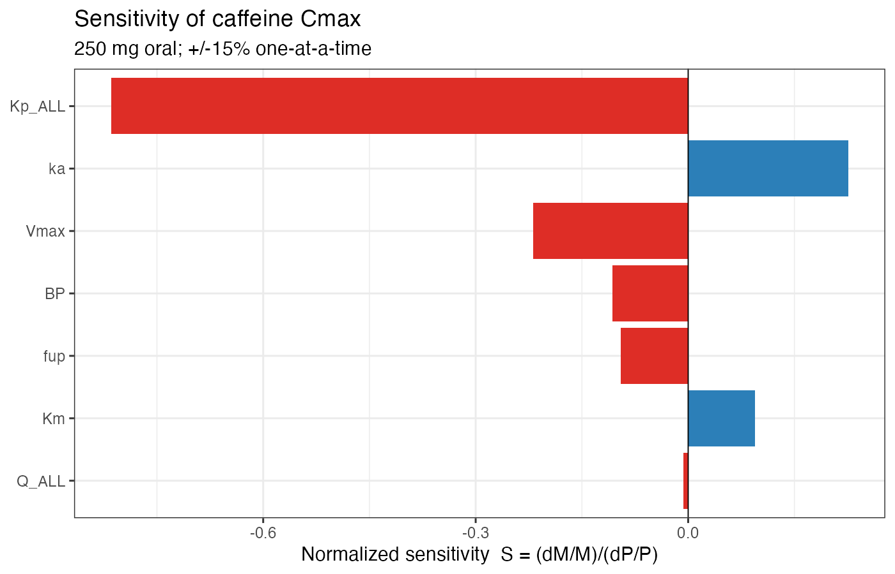
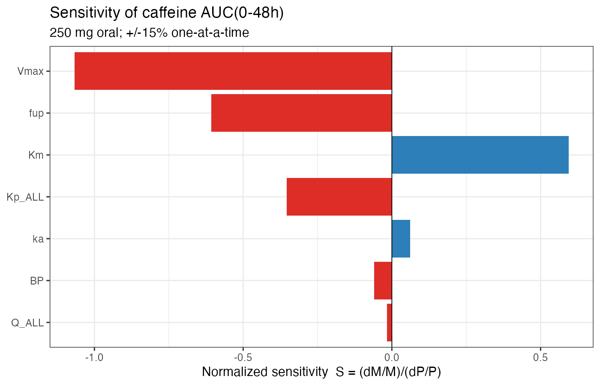

```{r setup}
library(readr); library(dplyr); library(knitr)
DIR_TAB <- "tables"; DIR_FIG <- "figures"; DIR_DAT <- "data"
rd <- function(f) readr::read_csv(file.path(DIR_TAB, f), show_col_types = FALSE)
```

## 1. Aim

Reproduce a published whole-body physiologically based pharmacokinetic (PBPK)
model of caffeine in `mrgsolve`, and validate the simulated plasma profile
against digitized clinical data. `mrgsolve` is a simulation engine, so this is a
structural reproduction: implement the model, enter cited parameters, simulate,
and compare — with every value carrying a status and a source.

Reference: Britz et al. 2019 (CPT:PSP, DOI 10.1002/psp4.12397) and the Open
Systems Pharmacology caffeine model.

## 2. Physiology

Generic human tissue volumes and blood flows come from Brown et al. (1997);
absolute quantities are computed from the reference body weight (70 kg) and
cardiac output (312 L/h), so the source percentages remain checkable. The liver
row carries hepatic-artery flow only and the gut row carries the portal share,
so liver total perfusion is not double-counted.

```{r physiology}
phys <- readr::read_csv(file.path(DIR_DAT, "physiology", "human_physiology.csv"),
                        show_col_types = FALSE)
kable(phys[, c("compartment","pct_body_weight","pct_cardiac_output","status")],
      caption = "Source physiology (Brown 1997).")
```

## 3. Drug parameters

Caffeine physchem and CYP1A2 kinetics were extracted from the OSP caffeine model.
PK-Sim stores values in internal base units; each was converted and flagged.

```{r drug-params}
cp <- readr::read_csv(file.path(DIR_DAT, "caffeine_params.csv"), show_col_types = FALSE)
kable(cp[, c("parameter","value","unit","status","source")],
      caption = "Caffeine compound parameters (provenance-tagged).")
```

## 4. Distribution: partition coefficients

Tissue:plasma partition coefficients are computed from PK-Sim's own
Willmann-Schmitt tissue composition (extracted via `ospsuite`) using the
Poulin-Theil method. For a neutral, hydrophilic drug like caffeine, Poulin-Theil
and Schmitt converge — validated by the resulting volume of distribution.

```{r partition}
kp <- readr::read_csv(file.path(DIR_DAT, "partition_coefficients.csv"),
                      show_col_types = FALSE)
kable(kp, caption = "Tissue:plasma partition coefficients (predicted Vss ~0.50 L/kg).")
```

## 5. Model

A perfusion-limited whole-body model (`models/caffeine_pbpk.cpp`): arterial and
venous blood, lung, 12 tissues, an oral depot; gut → portal → liver; hepatic
CYP1A2 Michaelis-Menten metabolism; renal clearance; mass-balance sinks. The
`.cpp` holds only neutral defaults — every runtime value is injected from the
data files by `R/03_build_model.R`.

## 6. Simulation and calibration

Distribution is fixed mechanistically (Schmitt Kp). The remaining misfit was a
pure clearance/terminal-slope problem: the in-vitro-scaled CYP1A2 Vmax gave a
~1.8 h half-life. Britz et al. themselves fit the CYP1A2 catalytic rate to
clinical data, so a Vmax scale and the oral `ka` were jointly calibrated to both
observed profiles.

```{r calibration}
cal <- rd("calibrated_params.csv")
kable(cal, caption = "Calibrated parameters (all physiology/Kp/fu/Km fixed).")
```

## 7. Validation

```{r validation}
val <- rd("validation_metrics.csv")
kable(val, digits = 3, caption = "Validation metrics: AAFE and % within 2-fold.")
```


The 250 mg curve tracks the observed profile across the full 24 h; both arms sit
entirely within the 2-fold acceptance band.

## 8. Sensitivity

Local one-at-a-time sensitivity (±15%) around the calibrated model. Individual
branch flows must sum to cardiac output, so a balanced global-perfusion probe is
used instead of perturbing one flow.

```{r sensitivity}
sens <- rd("sensitivity.csv")
kable(sens %>% filter(metric %in% c("Cmax","AUC")) %>% arrange(metric, -abs(S)),
      digits = 3, caption = "Normalized sensitivity of Cmax and AUC.")
```





AUC is governed by clearance capacity (Vmax, fu, Km) and is essentially
insensitive to perfusion — the signature of a low-extraction drug like caffeine.

## 9. Conclusion

The reproduced whole-body PBPK model recovers caffeine's disposition across two
clinical studies: Vss ≈ 0.50 L/kg from mechanistic distribution, AAFE ≈ 1.3 with
100% of points within 2-fold after calibrating only the CYP1A2 rate and
absorption, and physiologically correct sensitivity behavior. Limitations: the
200 mg absorption phase runs slightly high (first-order depot), and the terminal
half-life (3.8 h) is at the low end of caffeine's 4–6 h range.
